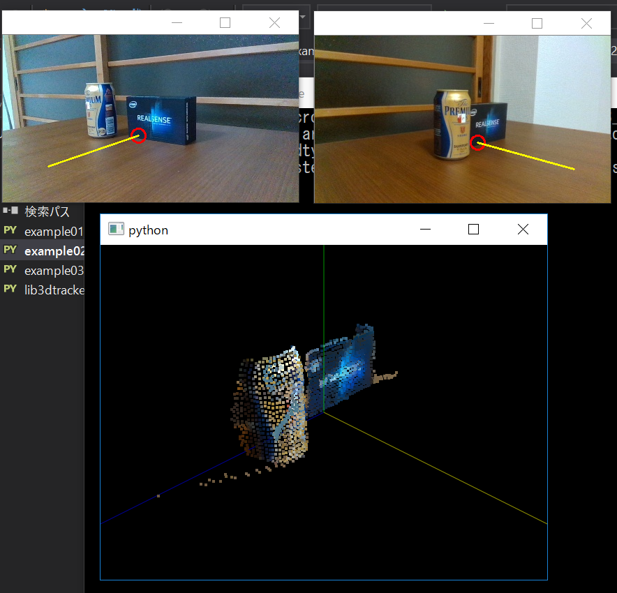
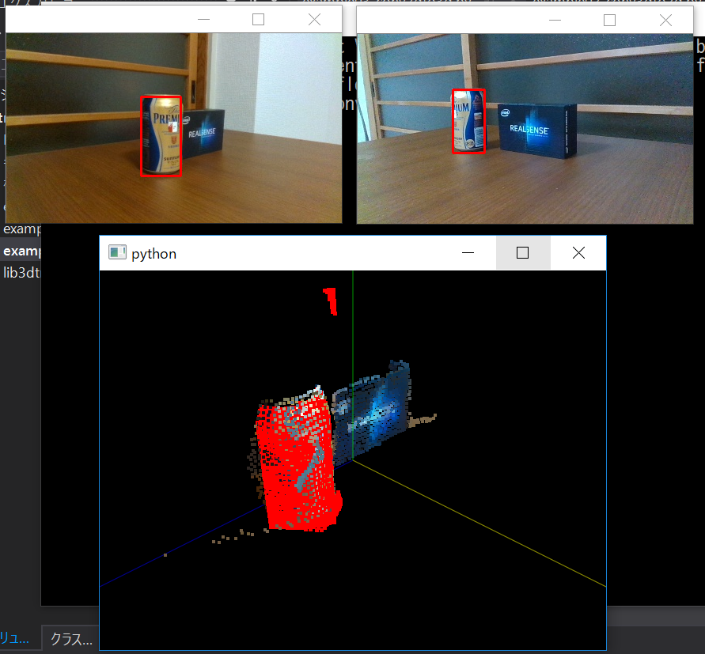

Python scripts for 3DTracker-FAB
================================

lib3dtracker.py
---------------

The main library.

+ functions read 2D and 3D image data recorded with 3DTracker-FAB
+ functions to convert 2D to 3D positions and vise versa.

example*.py
-----------

Examples showing how to use the library.

    [Output of example02; ploting Z axis on RGB images]

    [Output of example03; showing 3D points (red) in ROI]
